# Guessing Game

(Developer: Morgan Asare)

[Link to the website](https://worldguessinggame-6a1c3a2b64fc.herokuapp.com/)

## Table of Content

1. [Project Goals](#project-goals)
    1. [User Goals](#user-goals)
    2. [Site Owner Goals](#site-owner-goals)
2. [User Experience](#user-experience)
    1. [Target Audience](#target-audience)
    2. [User Requirements and Expectations](#user-requrements-and-expectations)
3. [Technologies Used](#technologies-used)
    1. [Languages](#languages)
    2. [Frameworks & Tools](#frameworks-&-tools)
4. [Features](#features)
5. [Testing](#validation)
    1. [Application Testing](#performing-tests-on-various-devices)
6. [Bugs](#Bugs)
7. [Deployment](#deployment)
8. [Credits](#credits)
9. [Acknowledgements](#acknowledgements)

## Project Goals
### User Stories

- Be able to sign up as new user
- Be able to login as existing user
- Be able read the rules of the game
- Be able to play a simple game of country guessing game

### Site Owner Goals
- Ensure user is able to create a user account
- Ensure user is able to enter username, email and password
- Ensure user is able to Login with username password already created
- Ensure user can read the instructions before playing the game
- Ensure the game is intuitive
- Ensure user is able to restart the game

## User Experience
### Target Audience

- User is able to create an account 
- User is able to login to the account
- User is able to find the instructions
- User is able to play the game easily

## Technologies Used

## Technical Design 
### Flowchart

- [Lucidchart](https://www.lucidchart.com) was used to build flowchart

    
Flowchart

    
GuessGame Game Flowchart

    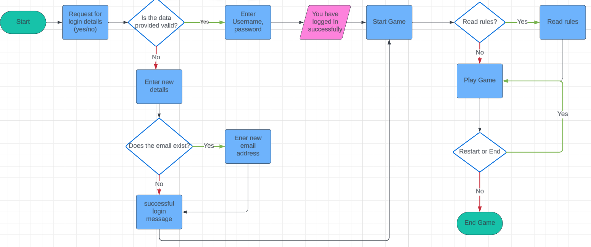

## Language Used
 - Python

## Libraries Used
- os - used to clear terminal
- random - used to choose random words
- re used for regex

### 3rd Party Python Libraries used
- Google sheets API was used to store and check the user input and authorise the user identity
- Google OAuth was used to connect the project with google account

### Other websites/tools used

- [GitHub](https://github.com/) was used for saving and storing files.
- [Heroku](https://www.heroku.com/) was used as the deploying platform for this site.

    
Hosted App on Heroku

    

 

## Features

## Login and SignUp
 - The first page welcomes the user to the game
 - Then User is asked if they already have an account or not
 - User gets a yes or no prompt for the program to proceed

 

    
Home Page screenshot

    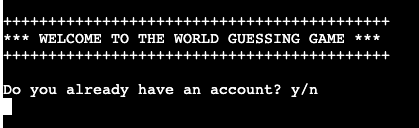

 

- If user has no account, the no answer takes them to the signup page
- User provides username, email and password
- email is in the format example@address.com

## Game page

- Game page loads once the user username and passwords are validated

 

    
Game Page screenshot

    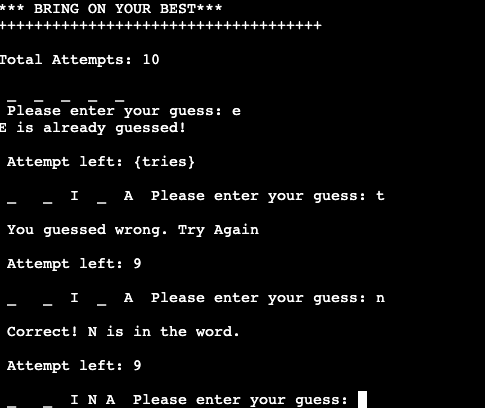

 

## Game starts

- User starts by guessing random letters that might form a country word
- User has 10 tries to guess the correct country

    
Game Start Page screenshot

    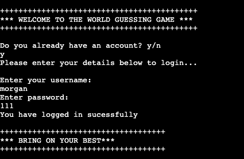

 

## Restart Game

- When User finish playin and wins there is a congratulation message
- User is asked if they want to play again

    
Finish Page screenshot

    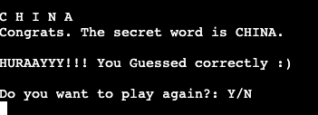

 

- If they selected yes for restart the game starts 

    
Restart Page screenshot

    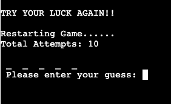

 

- If user decides to end the game by selecting no
- A goodbye message is displayed and prompted the application is logging out

    
Logout Page screenshot

    

 

## Testing

- Manual testing of user stories
- Testing on Browsers
- Tested Devices with Browsers
- Validator Testing

### Manual Testing

See user stories testing

1. I want to be able to have an option as existing user or new user

| **Feature**   | **Action**                    | **Expected Result**          | **Actual Result** |
| ------------- | ----------------------------- | ---------------------------- | ----------------- |
| Are you an existing user | Type Y/N | Y: Open login area / N: SignUp Area | Works as expected

    
Screenshots

    
Sign Up

    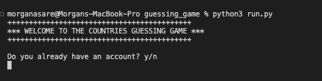
    
Log In

    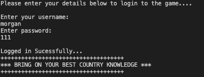

 

2. I want to able to signup as new user

| **Feature**   | **Action**                    | **Expected Result**          | **Actual Result** |
| ------------- | ----------------------------- | ---------------------------- | ----------------- |
| Sign Up Here | Enter New Username/ Enter New Password | Sign Up Complete : Login Page opens | Works as expected

    
Screenshots

    
Sign Up Area

    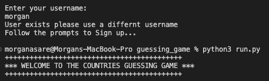
    
Login area opens after sign up is confirmed

    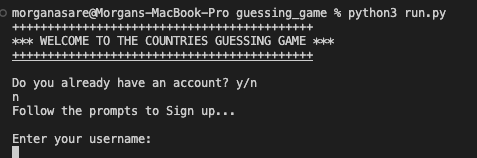

 

3. I want to be able to choose difficulty levels

| **Feature**   | **Action**                    | **Expected Result**          | **Actual Result** |
| ------------- | ----------------------------- | ---------------------------- | ----------------- |
| Choose difficulty level | Select E for Easy or A for Advanced | Login Successful : Opens level | Works as expected

    
Screenshots

    
Choose Level

    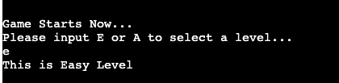   
    
Open rules is prompted after login is successful

    

 

4. I want to be able to log-in if I return to the game

| **Feature**   | **Action**                    | **Expected Result**          | **Actual Result** |
| ------------- | ----------------------------- | ---------------------------- | ----------------- |
| Login To Play GuessGame | Username/ Password | Login Successful : Open rules | Works as expected

    
Screenshots

    
Log In Area

    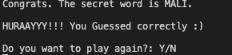   
    
Open rules is prompted after login is successful

    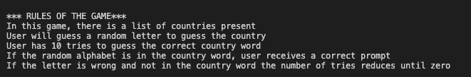

 

5. I want to be able to read the rules of the game

| **Feature**   | **Action**                    | **Expected Result**          | **Actual Result** |
| ------------- | ----------------------------- | ---------------------------- | ----------------- |
| Open Rules  | : Open rules Starts Game | Works as expected

    
Screenshots
   
    
Open rules is prompted

    
    

6. I want to be able to restart game when I'm logged in

| **Feature**   | **Action**                    | **Expected Result**          | **Actual Result** |
| ------------- | ----------------------------- | ---------------------------- | ----------------- |
| Restart Game  | Type Y/N| Y: Game restarts/ N: Game ends, User logged out | Works as expected

    
Screenshots
   
    
Restart is prompted

    
    
If user input is "Y"

    
    

7. I want user name and password to be saved to Google Spreadsheet

| **Feature**   | **Action**                    | **Expected Result**          | **Actual Result** |
| ------------- | ----------------------------- | ---------------------------- | ----------------- |
| Sign-Up | Users input their name and password which has not been previously registered  | Username and password are saved to Google Spreadsheet| Works as expected |

    
Screenshots

    
Google Spread Worksheet

    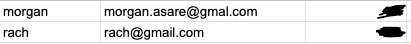      

 

8. I want the user to get errors displayed in case of wrong input

 **Feature**   | **Action**                    | **Expected Result**          | **Actual Result** |
| ------------- | ----------------------------- | ---------------------------- | ----------------- |
| Across all screen | User inputs invalid input when questions are prompted. User inputs invalid value during log-in or sign-up | Feedback message displayed to the user | Works as expected |

9. I want data entry to be validated, to guide the user on how to correctly format the input

| **Feature**   | **Action**                    | **Expected Result**          | **Actual Result** |
| ------------- | ----------------------------- | ---------------------------- | ----------------- |
| Across all screen | User inputs invalid data | Feedback message with instructions diplayed to the user | Works as expected |

10. I want user to see their name once they login

| **Feature**   | **Action**                    | **Expected Result**          | **Actual Result** |
| ------------- | ----------------------------- | ---------------------------- | ----------------- |
| Welcome (Username) | After successful login | Users are asked to input their username and password, and once validated, a greeting message with their name is displayed. | Works as expected |

    
Screenshots

    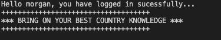

### Testing on Browsers
- I tested that this game works in different browsers - Chrome and Safari and was able to deploy successfully

### Tested Devices with Browsers
- iPhone 12
    - Safari
- Samsung S22 Ultra
    - Chrome
- Macbook Pro 2019 16-inch
    - Chrome
    - Safari
 
## Validator Testing
### [PEP8 Python Validator] was used to validate the code

- This validator was provided by Code institute
- - no significant errors were found
 

    
authentication.py

    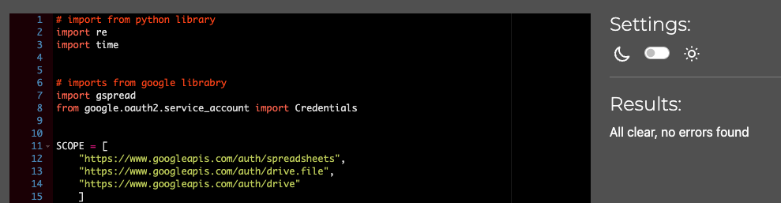

 

    
game.py

    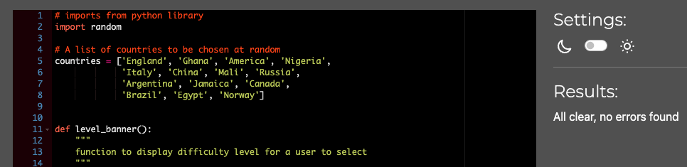

 

    
run.py

    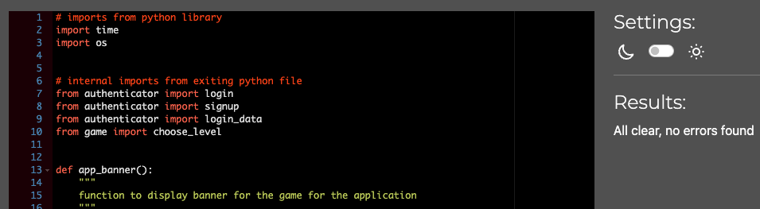

 

### Bugs and Fixes

| **Bugs** | **Fixes** |
| ------- | ------- |
| Users were able to sign up multiple times with same username | Add signup_check function which will prompt again if user exist or not|
| Users could sign up with blank username | Add validation to check if user did not input a name|
| regex error sometimes when the game starts | Included 'r' string which enabled backslash to escape some characters |

### Unfixed Bugs

- A function was created to update a different sheet of scores and players to create a leaderboard
- However an unexpected result was encounted when the game starts so this part had to be taken 
- out of the game.

## Deployment

### Deploying the website in Heroku:
- The website was deployed to Heroku using the following steps:
#### Login or create an account at Heroku
- Create a student account on Heroko and login

    
Heroko Login Page

    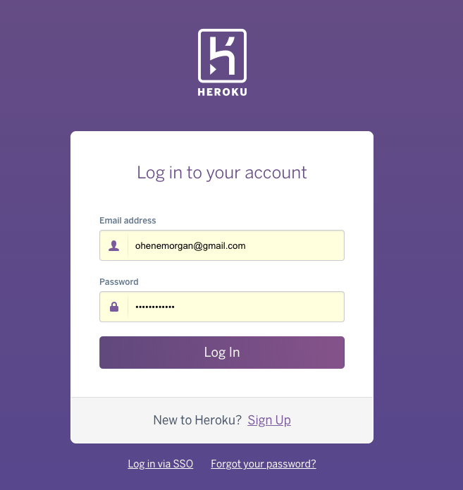

#### Creating an app
  - Create new app in the top right of the screen and add an app name.
  - Select region
  - Then click "create app".

    
Create App

    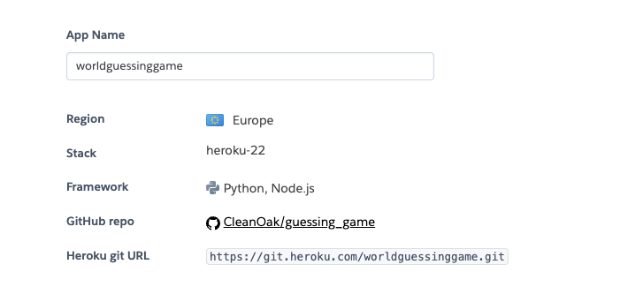

#### Open settings Tab
  ##### Click on config var
  - Store CREDS file from gitpod in key and add the values
  - Store PORT in key and value

    
Config var

    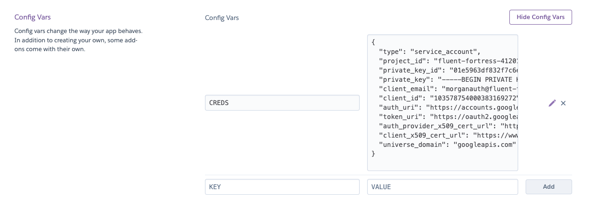

  ##### Add Buildpacks
  - Add python buildpack first
  - Add Nodejs buildpack after that

    
Buildpacks

    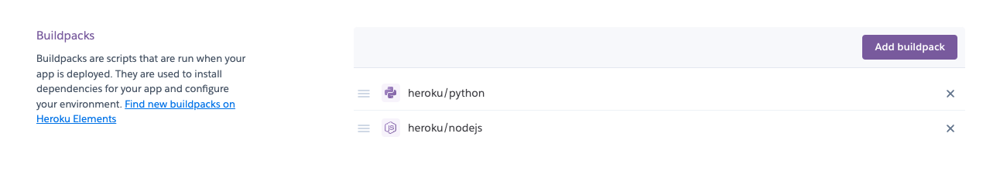

 #### Open Deploy Tab
   ##### Choose deployment method
  - Connect GITHUB
  - Login if prompted

    
Deployment method

    

   ##### Connect to Github
  - Choose repositories you want to connect
  - Click "Connect"

    
 Repo Connect

    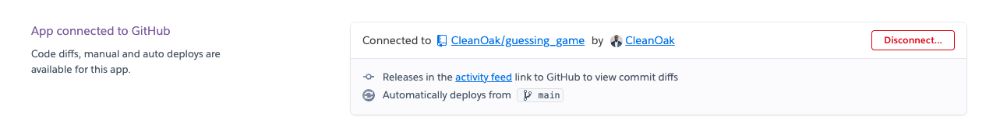

  ##### Automatic and Manual deploy
  - Choose a method to deploy
  - After Deploy is clicked it will install various file

    
 Deploy methods

    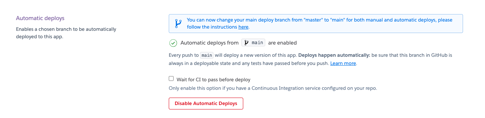

  ##### Final Deployment
  - A view button will display
  - Once clicked the website will open

    
 Deploy

    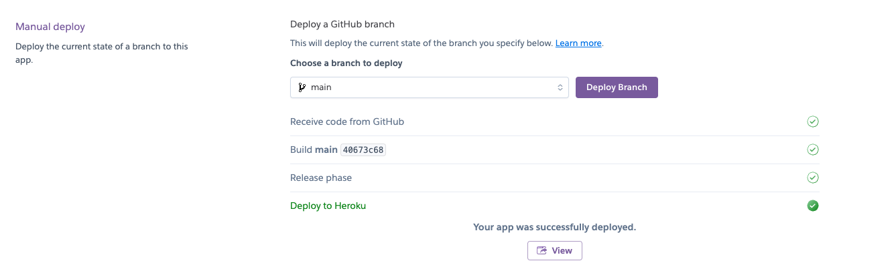

## Credits

- The Idea was from Geeks for Geeks [Geeks for Geeks](https://www.geeksforgeeks.org/python-program-for-word-guessing-game/)
- Some of the code was borrowed from [hangman-pp3](https://github.com/Sinha5714/hangman-pp3)
- Also, regex for validating passwords was borrowed from [Tutorialspoint](https://www.tutorialspoint.com/password-validation-in-python)
### Content
- The idea of Guessing Game was taken from other word guessing games played around the world

### Code
#### The following ideas were borrowed from [Love Sandwiches](https://github.com/Sinha5714/Love_Sandwiches)
####

-  validate_user_details function
-  How to import gspread
-  How to import Credentials from google.oauth
- [W3 Schools](https://validator.w3.org/nu/)
- [Stack Overflow](https://validator.w3.org/nu/)
- [hangman-pp3](https://github.com/Sinha5714/hangman-pp3)

## Acknowledgement
- to my mentor Mo Shami for supporting me with his feedback through the entire project
- Special thanks to my friend Amoafo who is always ready to support me on the journey
- Also to my dear wife for beign there for me eventhough I have to abandon some family duties
